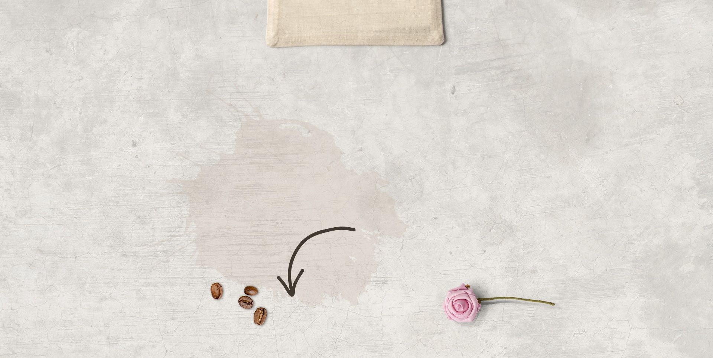

# ☕ AURA – Luxury Coffee Shop Website

<p align="center">
  
  
  
  
  
  
  
</p>

<p align="center">
  
  
  
</p>

<br>

<!-- HERO IMAGE - Replace with your actual screenshot -->
<p align="center">
  
</p>

<br>

## ✨ About

**AURA** is a modern, luxury coffee shop website designed to deliver a premium digital experience. Built with a focus on **elegant UI/UX**, **responsive layouts**, and **smooth animations**, this project showcases a complete frontend implementation for a high-end coffee brand.

Whether you're a developer looking for inspiration, a designer exploring layout patterns, or a business owner planning a web presence — AURA serves as a polished, production-ready template.

> **Live Demo:** [🔗 Update this with your live URL](https://your-demo-link.com) <!-- Replace with actual URL -->

<br>

## 📸 Screenshots

<!-- Replace these placeholder paths with actual screenshot paths -->
<p align="center">
  <table>
    <tr>
      <td align="center"></td>
      <td align="center"></td>
    </tr>
    <tr>
      <td align="center"><em>🏠 Home / Hero Section</em></td>
      <td align="center"><em>📋 Menu Display</em></td>
    </tr>
  </table>
</p>

<br>

## 🚀 Features

| # | Feature | Details |
|---|---------|---------|
| 🏠 | **Responsive Header** | Sticky navigation with mobile hamburger toggle |
| 🖼️ | **Hero Carousel** | Interactive image slider for featured coffee |
| 📖 | **About Section** | Brand story with quality icons & visual layout |
| ☕ | **Menu Grid** | 6-item coffee menu with pricing & descriptions |
| ⭐ | **Customer Reviews** | Swiper-powered testimonial carousel |
| 📅 | **Booking Form** | Table reservation with name, email, phone & message |
| 📱 | **Fully Responsive** | Adaptive layout from mobile to desktop (320px+) |
| 🎨 | **Elegant Design** | Warm tones, smooth transitions, modern typography |
| 🧭 | **Footer Navigation** | Branch info, quick links, contact & social media |

<br>

## 🛠️ Tech Stack

| Technology | Purpose |
|------------|---------|
|  | Semantic structure & markup |
|  | Styling, layout, animations & responsive design |
|  | Interactivity, DOM manipulation & logic |
|  | Touch-enabled carousels & sliders |
|  | Icon library for UI elements |

<br>

## 📁 Folder Structure

```
coffee-shop-website/
│
├── index.html              # Main HTML document
├── README.md               # Project documentation
│
├── css/
│   └── style.css           # All custom styles
│
├── js/
│   └── script.js           # All JavaScript logic
│
└── image/
    ├── home-img-1.png      # Hero coffee image
    ├── home-img-2.png      # Hero coffee image
    ├── home-img-3.png      # Hero coffee image
    ├── about-img.png       # About section visual
    ├── about-icon-1.png    # Quality coffee icon
    ├── about-icon-2.png    # Branches icon
    ├── about-icon-3.png    # Delivery icon
    ├── menu-1.png          # Menu item 1
    ├── menu-2.png          # Menu item 2
    ├── menu-3.png          # Menu item 3
    ├── menu-4.png          # Menu item 4
    ├── menu-5.png          # Menu item 5
    ├── menu-6.png          # Menu item 6
    ├── pic-1.png           # Reviewer avatar
    ├── pic-2.png           # Reviewer avatar
    ├── pic-3.png           # Reviewer avatar
    ├── pic-4.png           # Reviewer avatar
    ├── home-bg.jpg         # Home background
    ├── menu-bg.jpg         # Menu background
    ├── book-bg.jpg         # Booking section background
    └── ...
```

<br>

## ⚡ Installation

Getting started is as simple as opening a file. No build tools or package managers required.

### Prerequisites

- A modern web browser (Chrome, Firefox, Safari, Edge)
- A code editor (VS Code recommended)
- Git (optional, for version control)

### Clone & Run

```bash
# Clone the repository
git clone https://github.com/Prasadboy-ux/coffee-shop-website.git

# Navigate into the project
cd coffee-shop-website

# Open in browser (Windows)
start index.html

# Or open manually — just double-click index.html
```

> 💡 **Tip:** Use [Live Server](https://marketplace.visualstudio.com/items?itemName=ritwickdey.LiveServer) in VS Code for auto-reload on changes.

<br>

## 🖥️ Usage

Simply open `index.html` in your browser. The website includes:

- **Navigation:** Click nav links to smoothly scroll to each section
- **Image Slider:** Click/swipe through the 3 hero images at the home section
- **Reviews:** Swipe through customer testimonials (Swiper carousel)
- **Booking:** Fill in the reservation form (client-side demo)
- **Mobile Menu:** Tap the hamburger icon on smaller screens

### Customization

To personalize the website:

1. **Logo / Branding** — Replace the `logo` text in the header
2. **Images** — Swap files in the `/image/` directory
3. **Colors** — Edit CSS variables in `css/style.css`
4. **Content** — Update text directly in `index.html`

<br>

## 📱 Responsive Design

| Breakpoint | Target Devices |
|------------|----------------|
| > 1200px   | Large desktops |
| 991px      | Small desktops / tablets |
| 768px      | Portrait tablets |
| 450px      | Mobile phones |

The layout adapts seamlessly from **320px** (small phones) to **1920px+** (ultrawide), using CSS media queries, fluid typography, and flexible grids.

<br>

## 🌐 Browser Compatibility

| Browser | Status |
|---------|--------|
| ✅ Google Chrome | Fully supported |
| ✅ Mozilla Firefox | Fully supported |
| ✅ Microsoft Edge | Fully supported |
| ✅ Safari (macOS/iOS) | Fully supported |
| ✅ Opera | Fully supported |

<br>

## ⚡ Performance & Accessibility

- ✅ Semantic HTML5 elements for better screen reader support
- ✅ Optimized image assets for faster load times
- ✅ External CDN resources (Swiper, Font Awesome) for reliable delivery
- ✅ Smooth CSS transitions & minimal JavaScript for high FPS
- ✅ Mobile-first responsive design
- ✅ `alt` attributes on all images
- ✅ Logical heading hierarchy (`h1` → `h3`)

<br>

## 🔮 Future Improvements

- [ ] **Dark mode** toggle with CSS custom properties
- [ ] **Backend integration** for the booking form (Node.js / PHP)
- [ ] **Lazy loading** for images to improve initial load time
- [ ] **SEO meta tags** for better search engine ranking
- [ ] **CSS Grid** refinements for even tighter layouts
- [ ] **Accessibility audit** (ARIA labels, keyboard navigation)
- [ ] **Animations** on scroll (Intersection Observer)
- [ ] **PWA** support with service worker & manifest

<br>

## 🤝 Contributing

Contributions are what make the open-source community such an amazing place to learn, inspire, and create. Any contributions you make are **greatly appreciated**!

1. 🍴 Fork the Project
2. 🌿 Create your Feature Branch (`git checkout -b feature/AmazingFeature`)
3. 💾 Commit your Changes (`git commit -m 'Add some AmazingFeature'`)
4. 📤 Push to the Branch (`git push origin feature/AmazingFeature`)
5. 🔄 Open a Pull Request

> Please ensure your code follows the existing style conventions.

<br>

## 📄 License

Distributed under the **MIT License**. See `LICENSE` for more information.

```
MIT License

Copyright (c) 2025 Prakash Prasad

Permission is hereby granted, free of charge, to any person obtaining a copy
of this software and associated documentation files (the "Software"), to deal
in the Software without restriction, including without limitation the rights
to use, copy, modify, merge, publish, distribute, sublicense, and/or sell
copies of the Software, and to permit persons to whom the Software is
furnished to do so, subject to the following conditions...
```

<br>

## 👨‍💻 Author

<p align="left">
  <b>Prakash Prasad</b>
  <br>
  <a href="https://github.com/Prasadboy-ux">
    
  </a>
  <br>
  Frontend Developer | UI Enthusiast | Open Source Contributor
</p>

---

## 🙏 Acknowledgments

- [Swiper](https://swiperjs.com/) — Touch slider library
- [Font Awesome](https://fontawesome.com/) — Icon toolkit
- [Unsplash](https://unsplash.com/) — Stock imagery (for future use)
- [Shields.io](https://shields.io/) — Badge generation
- All contributors and users of this project

---

<p align="center">
  Made with ❤️ by <a href="https://github.com/Prasadboy-ux">Prakash Prasad</a>
  <br>
  ⭐ If you found this project helpful, consider giving it a star!
</p>

